<div align="center"></div>
<h1 align="center">Soap Opera</h1>
<div align="center">


</div>


**Soap Opera** is a web-based **Laravel** laundry management system for running a laundry shop: taking orders at the counter, tracking payments and order status, and reporting daily and monthly sales.
It replaces paper job orders and notebooks with a **point of sale, order tracking, customer records, inventory and reports** in one place, and works on desktop, tablet and phone. The interface uses a soft blue-and-white bubble theme with rounded cards and glossy, 3D-style icons.

> **Current version: v1.1.0** — the app is now **Soap Opera**, with a new blue-and-white bubble look on every page, a redesigned login page and dashboard, and a POS that groups services into sections by service type. Built on v1.0.0, the first stable release: real database backup and restore, correct order totals and payments, role-based access, faster pages and a mobile-friendly layout. See [Releases](https://github.com/nncast/laravel-laundry-management-system/releases) for the release notes.

<p align="center">
  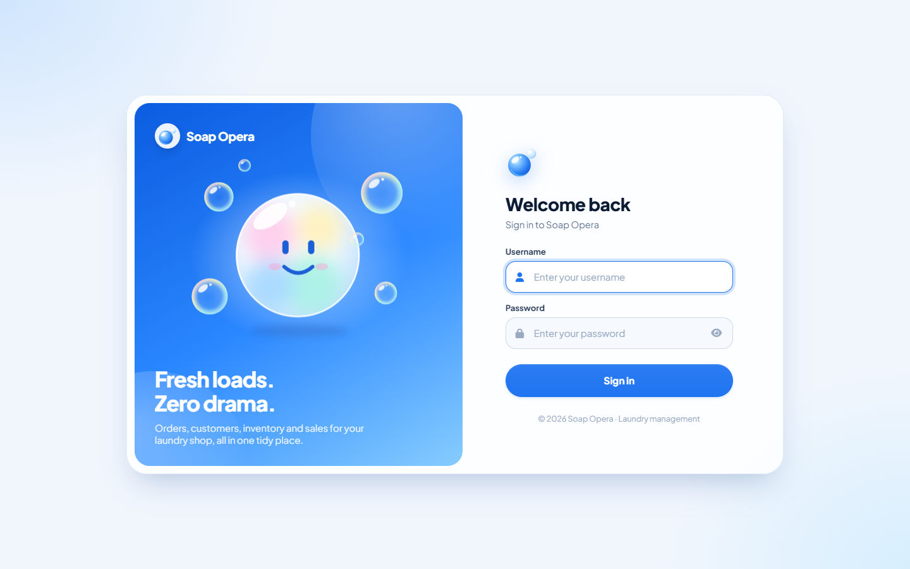
  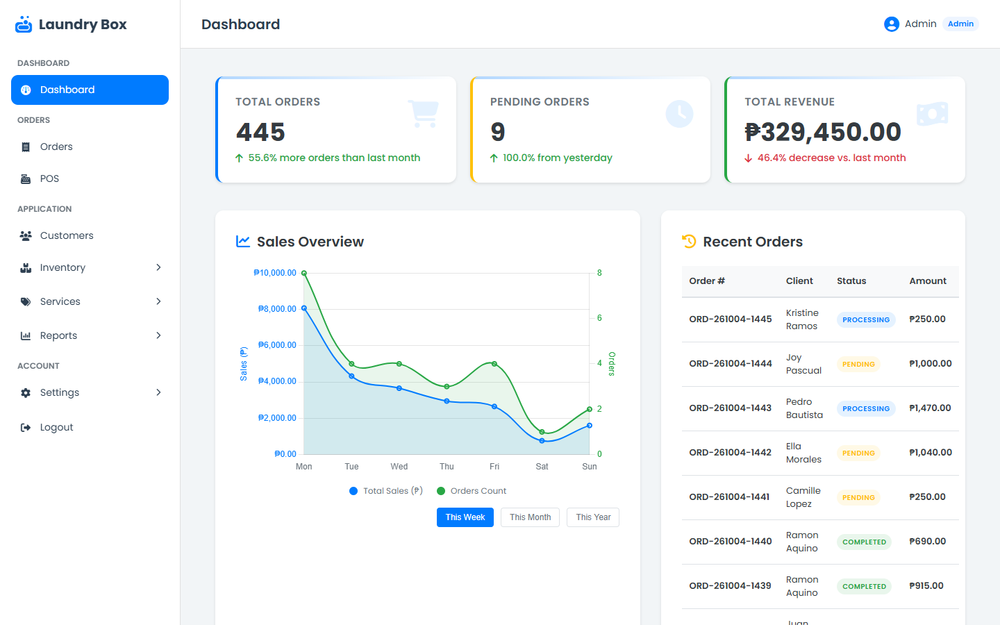
  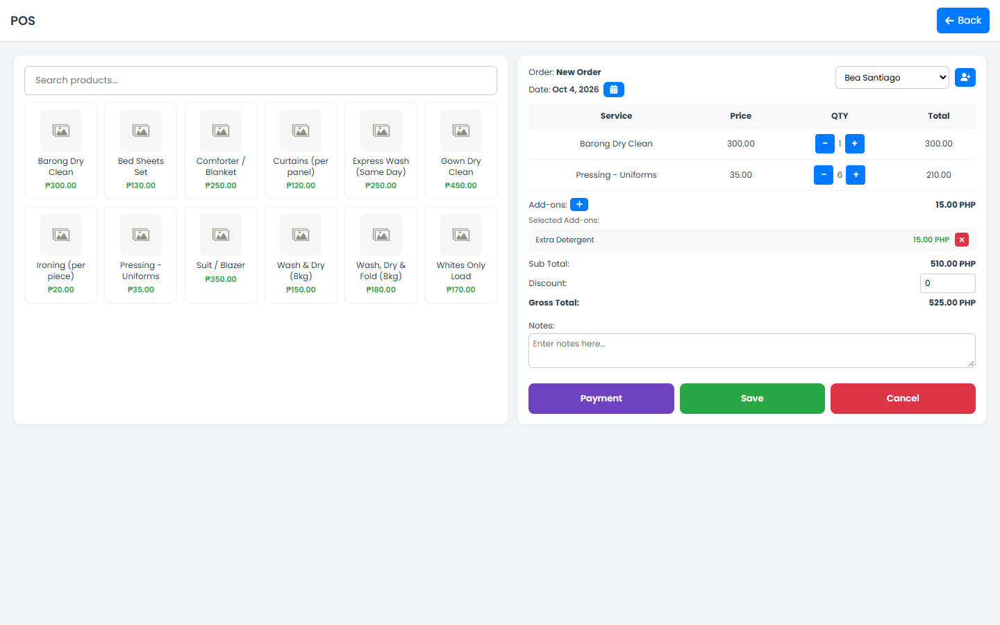
  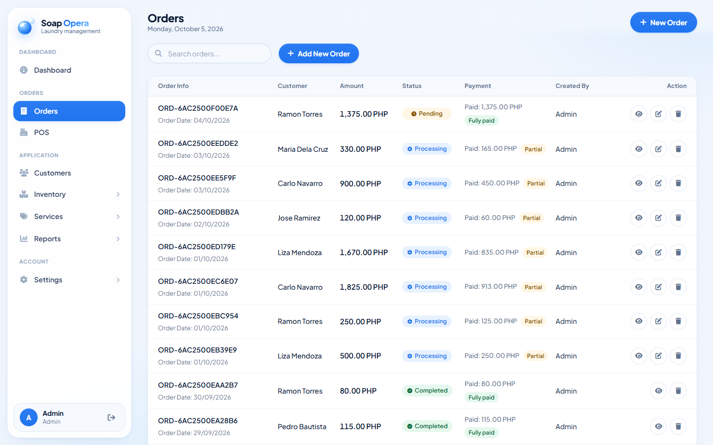
  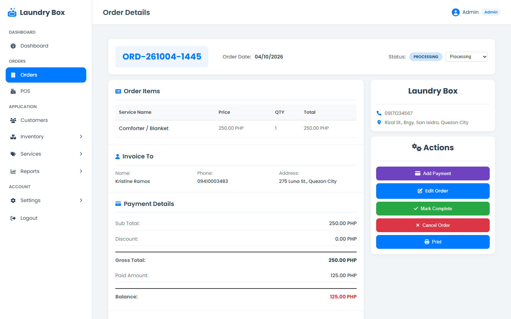
  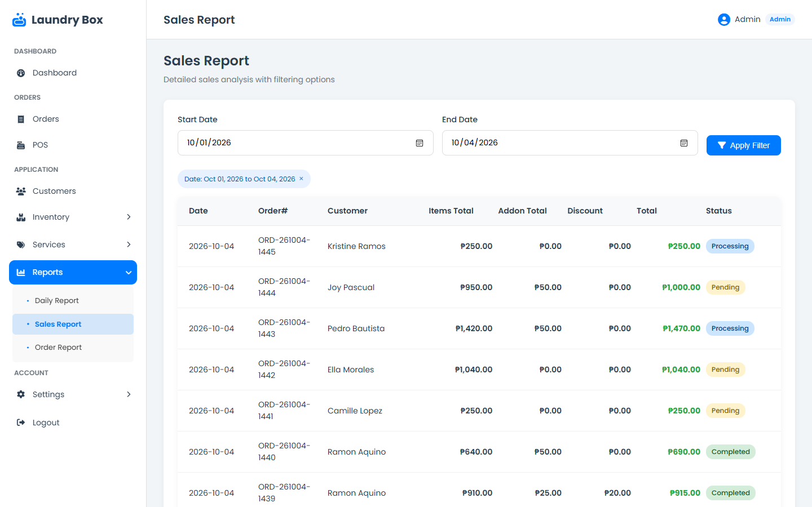
</p>

<p align="center">
  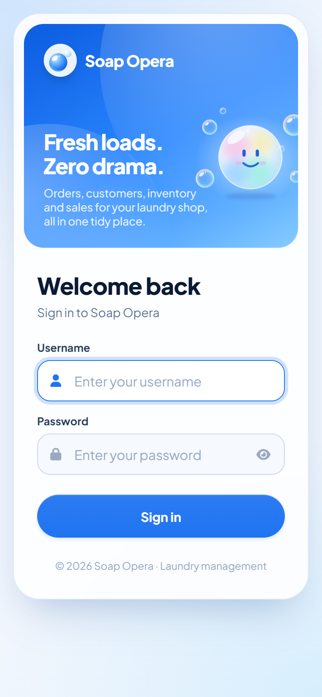
  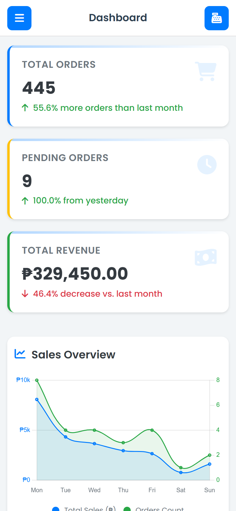
  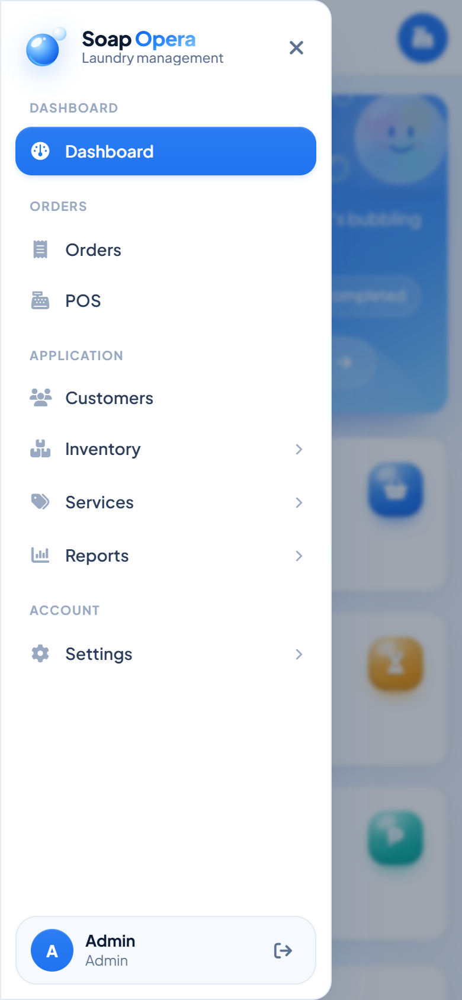
  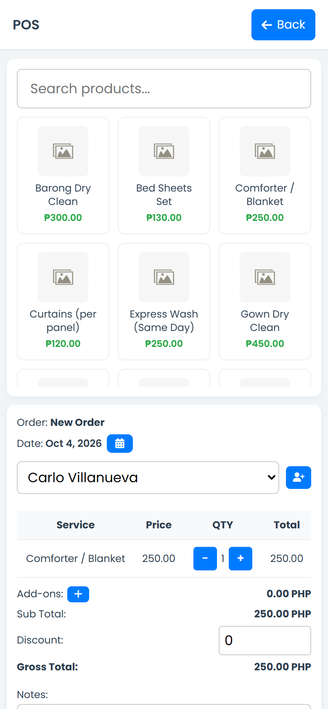
</p>

## Features

**Point of Sale & Orders**
- POS screen to pick services, quantities and add-ons, apply a discount and take payment
- Services grouped into sections by service type, with category filters, search and a count badge on items already in the order
- Change is calculated for cash payments; only the amount owed is recorded
- Partial payments, with the remaining balance tracked per order
- Order status flow: **Pending → Processing → Completed** (or Cancelled)
- Order details page with payments, notes, editing and a printable view

**Records**
- Customers with contact number and address
- Services (with price, type and icon), service types and add-ons
- Inventory: products, categories and units with stock levels
- Staff accounts with Admin, Manager and Cashier roles

**Reports**
- Dashboard with today's income, pending orders, top services and a weekly / monthly / yearly sales chart
- Daily, Sales and Order reports with date and status filters
- CSV export (opens in Excel) and print

**Settings & Backup**
- Business name, address, contact number and logo (favicon)
- One-click database backup (`.sql` file with all data)
- Restore from a backup, with an automatic safety backup taken first

## Roles

| Page | Cashier | Manager | Admin |
| --- | :---: | :---: | :---: |
| Dashboard, POS, Orders, Customers | ✓ | ✓ | ✓ |
| Delete orders and customers | | ✓ | ✓ |
| Inventory and Services | | ✓ | ✓ |
| Reports | | | ✓ |
| Staff, Master Settings, Backup & Restore | | | ✓ |

## Development environment

| Category | Details |
| --- | --- |
| Language | PHP 8.2+ |
| Framework | Laravel 12 |
| Front end | Blade templates, plain CSS and JavaScript, Font Awesome, Chart.js |
| Database | MySQL / MariaDB (XAMPP or Laragon) or SQLite |
| Tests | PHPUnit (`php artisan test`) |

## Requirements

| Tool | Download |
| --- | --- |
| PHP 8.2 or later (XAMPP 8.2+ or Laragon) | [XAMPP](https://www.apachefriends.org/download.html) · [Laragon](https://laragon.org/download/) |
| Composer | [getcomposer.org](https://getcomposer.org/download/) |
| MySQL / MariaDB (included in XAMPP and Laragon) | — |
| Git (optional, for cloning) | [git-scm.com](https://git-scm.com/downloads) |

> **Note:** Laravel 12 needs **PHP 8.2 or later**. Older XAMPP versions ship PHP 8.0 — check with `php -v`. Node.js / npm are **not** needed.

## Setup and run instructions

### 1. Start MySQL
- **XAMPP:** open the XAMPP Control Panel and start **MySQL**
- **Laragon:** click **Start All**

### 2. Clone the project
```bash
git clone https://github.com/nncast/laravel-laundry-management-system.git
cd laravel-laundry-management-system
```
Or download the [source .zip](https://github.com/nncast/laravel-laundry-management-system/archive/refs/tags/v1.1.0.zip) and extract it.

### 3. Install dependencies
```bash
composer install
```

### 4. Setup environment
```bash
# Windows (CMD)
copy .env.example .env

# Linux / macOS
cp .env.example .env
```

Generate app key:

```bash
php artisan key:generate
```

### 5. Configure database

Edit the `.env` file:
```env
DB_CONNECTION=mysql
DB_HOST=127.0.0.1
DB_PORT=3306
DB_DATABASE=laundry_system
DB_USERNAME=root
DB_PASSWORD=

APP_TIMEZONE=Asia/Manila
SESSION_DRIVER=file
CACHE_STORE=file
```

> Use `127.0.0.1`, not `localhost`. On Windows, `localhost` can add about a second to every page load.

<details>
<summary>Using SQLite instead of MySQL</summary>

Keep `DB_CONNECTION=sqlite` in `.env` and create an empty database file:

```bash
# Windows (CMD)
type nul > database\database.sqlite

# Linux / macOS
touch database/database.sqlite
```
</details>

### 6. Run migrations and seed

```bash
php artisan migrate --seed
```

If prompted with:

```bash
WARN  The database 'laundry_system' does not exist on the 'mysql' connection.

Would you like to create it? (yes/no) [yes]
```

Type:

```bash
yes
```

Then press `Enter`.

### 7. Start the app
```bash
php artisan serve
```

Open `http://localhost:8000` in your browser.

---

## Default Account

| Role | Username | Password |
|------|----------|----------|
| Admin | `admin` | `admin123` |

**Important:** change the default password after first login (**Settings → Staff**), and set your business name and logo under **Settings → Master Setting**.

## Backup & Restore

Go to **Settings → Master Setting → Data Backup**.

<p align="center">
  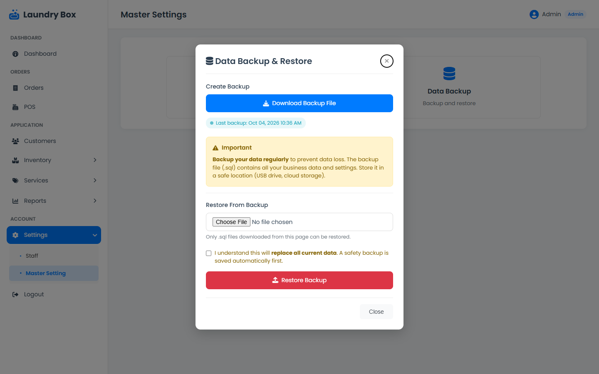
</p>

- **Download Backup File** saves a `.sql` file with every table and record. Keep it somewhere safe (USB drive or cloud storage).
- **Restore Backup** replaces all current data with a backup made by this system. A safety backup of the current data is saved to `storage/app/backups` first, and you are logged out afterwards.

## Upgrading

**From v1.0.0 or v1.0.1:** pull or download v1.1.0 and replace the files. There are no database changes, so no migration is needed. Your business name, address and logo are kept.

**From 0.9.0:**

1. Download a backup from **Settings → Master Setting** first.
2. Pull or download the latest version (v1.1.0), then run:
   ```bash
   composer install
   php artisan migrate
   ```
3. Add `APP_TIMEZONE=Asia/Manila` to your `.env`, and change `DB_HOST=localhost` to `DB_HOST=127.0.0.1` if you use MySQL.

The migration adds the payment method column and report indexes, and recalculates the totals and paid amounts of existing orders that earlier versions saved incorrectly.

## Running tests

```bash
php artisan test
```

## Contributing

Contributions are welcome. Fork the repository, work on a branch from `main`, and open a pull request describing what changed and why. See [CONTRIBUTING.md](CONTRIBUTING.md) for the workflow and code style, and [AUTHORS.md](AUTHORS.md) for the people who built it.

## Security

Please don't report vulnerabilities in public issues. Use the repository's **Security → Report a vulnerability** tab instead. See [SECURITY.md](SECURITY.md) for details.

---

*Soap Opera · Laundry Management System · 2025 · Laravel 12 · PHP 8.2 · MySQL / SQLite*
